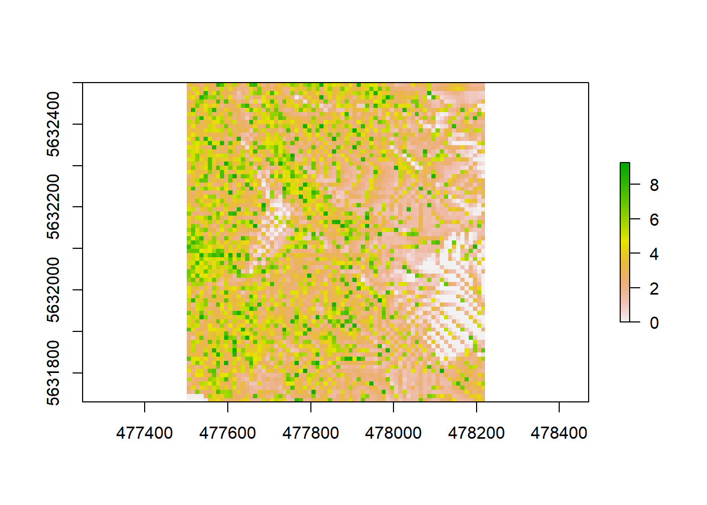

# Task 
Our research question is:
Is it possible to derive a suitable set of predictor variables from LiDAR data to obtain a reliable prediction of the microclimate parameters temperature and humidity?

The following Task had to be performed: 

- Read the ressources related to forest and identify those which you will use for attempting the task.
- Decide which algorithms and indices are adequate to answer the research question.
- Apply and document this findings with on base of the scripts of the this unit experiences.

To solve this task I read a few articles and selected "Simulations of Leaf BSDF Effects on Lidar Waveforms" (Roth et al. 2020).
They described the calculation of the Leaf Area Index (LAI). I thought that it might be posible to predict temperature and humidity from the LAI. I did some research and I read that eg. Hardwick et al. (2014) found out that, if the LAI is high, humidity and temperature are low and if the LAI is low, humidity and temperature are high. This means you can not predict temperature and humidity exactly from the LAI but LAI is a predictor. 

Based on these findings we are trying to calculate the LAI onto our research area close to Marburg. Roth et al. (2010) described that he used the formula of Kamoske et al. (2019) to calculate the LAI. To calculate it Kamoske build a R-Packege called "canopyLazR" which I used for this assignment. The following code does describe the calculation of the LAI. 


We load our data. As the created array takes alot of memory and the loading takes some time I can not lower the "voxel.resolution" argument. 

```r
# Convert .laz or .las file into a voxelized lidar array
laz.data <- laz.to.array(laz.file.path = file.path(envrmt$path_lidar_org,"las_mof.las"), 
                         voxel.resolution = 10, 
                         z.resolution = 1,
                         use.classified.returns = TRUE)

# Level the voxelized array to mimic a canopy height model
level.canopy <- canopy.height.levelr(lidar.array = laz.data)

# Estimate Leaf Area Density (LAD) for each voxel in leveled array
lad.estimates <- machorn.lad(leveld.lidar.array = level.canopy, 
                             voxel.height = 1, 
                             beer.lambert.constant = NULL)

# Convert the LAD array into a single raster stack
lad.raster <- lad.array.to.raster.stack(lad.array = lad.estimates, 
                                        laz.array = laz.data, 
                                        epsg.code = 25832)
```

```
## Warning in showSRID(uprojargs, format = "PROJ", multiline = "NO", prefer_proj = prefer_proj): PROJ/GDAL PROJ string degradation in workflow
##  repeated warnings suppressed
##  Discarded datum European_Terrestrial_Reference_System_1989 in Proj4 definition
```

```r
# Create a single LAI raster from the LAD raster stack
lai.raster <- raster::calc(lad.raster, fun = sum, na.rm = TRUE)
```


```r
#Plotting the LAI 
plot(lai.raster)
```


  


The LAI is in the western part of our research area the highest while in the east the LAI is the lowest. 
This would mean that in the eastern part it can be expected that our temperature and humidity is higher than in west. 


# References

- Hardwick, S.R., Toumi, R., Pfeifer, M., Turner, E.C., Nilius, R. & R.M. Ewers (2014): The relationship between leaf area index and microclimate in tropical forest and oil palm plantation: Forest disturbance drives changes in microclimate. Agricultural and Forest Meteorology. 201. 187-195. <https://doi.org/10.1016/j.agrformet.2014.11.010> 
- Kamoske, A.G. (2020): canopyLazR. <https://github.com/akamoske/canopyLazR> 
- Roth, D.B., Goodenough, A.A.,Brown, S.D., van AArdt, J.A., Saunders, M.G. & K. Krause (2020): Simulations of Leaf BSDF Effects on Lidar Waveforms. Remote Sensing. 12. 2909. <https://doi.org/10.3390/rs12182909>
